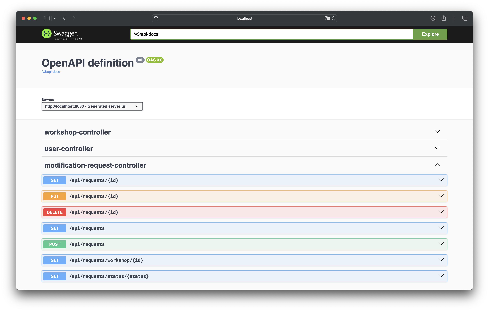

# 📘 **README – PartsFlow (Backend + PostgreSQL)**

## 🚗 Présentation

**PartsFlow** est un MVP développé pour gérer les pièces, leurs modifications et les interactions entre les différents acteurs d’un environnement industriel.  
L’objectif est d’offrir une base technique fiable avec une architecture **Java / Spring Boot**, **PostgreSQL**, et une orchestration via **Docker Compose**.

Ce repository contient :

- Un backend **Spring Boot** (Java 17)
- Une base de données **PostgreSQL**
- Un environnement de développement **dockerisé**
- Une API REST permettant de gérer : Users, Parts, Workshops, Requesters, Modification Requests, Approvals…

Le frontend n’étant pas finalisé, ce repo se concentre sur une base backend stable et professionnelle.

---

# 🐳 **Lancer l’application avec Docker**

Assurez-vous d'avoir **Docker** et **Docker Compose** installés.

### 1. Construire et démarrer les conteneurs

```bash
docker compose up --build
```

Les services suivants seront lancés :

| Service | Port | Description |
|---------|------|-------------|
| `backend` | **8080** | Application Spring Boot |
| `db`      | **5432** | PostgreSQL database |

Les logs du backend apparaîtront dans votre terminal.

### 2. Vérifier que tout fonctionne

```bash
docker ps
```

Vous devriez voir :

- `partsflow-backend`
- `partsflow-db`

---

# 📡 **URL de base de l’API**

```
http://localhost:8080/api
```

### 🖼️ Vue d'ensemble de l'API



---

# 🗂️ **Structure du projet**

```text
backend/
 ├── src/
 │   ├── main/
 │   │   ├── java/com/partsflow/backend/...
 │   │   └── resources/
 │   └── test/
 ├── Dockerfile
docker-compose.yml
partsflow_collection.json
```

---

# 🧰 **Technologies utilisées**

- **Java 17**
- **Spring Boot 3**
- **Spring Security + JWT**
- **Spring Data JPA**
- **PostgreSQL 16**
- **Docker / Docker Compose**
- **Maven**
- **Git / GitHub**

---

# 📄 **Notes**

Le frontend React/TypeScript n'étant pas suffisamment avancé pour une démonstration professionnelle, il a été retiré afin de concentrer ce repository sur une base backend propre, stable, et facilement déployable.

---

# 🎯 **Objectif du MVP**

Ce projet a été développé pour :

- démontrer la compréhension du besoin fonctionnel décrit dans l’offre de stage Toyota,  
- proposer une architecture backend robuste,  
- fournir un environnement de développement dockerisé et réaliste,  
- présenter une base technique extensible (API REST complète, modèles métier, sécurité).

---


